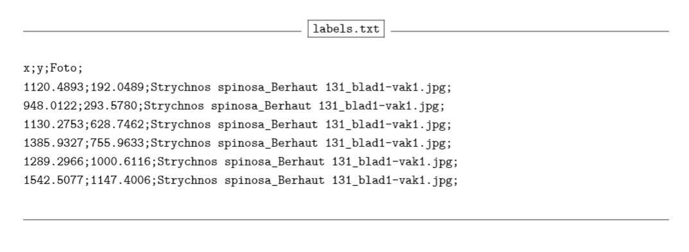
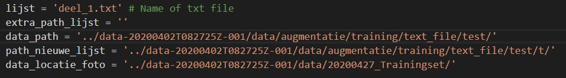
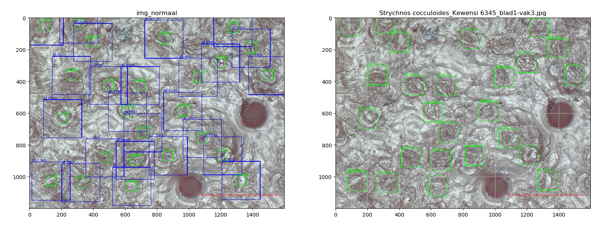
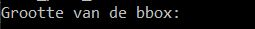
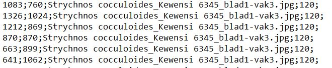

# Augmentation

This project is used for data preprocessing in object detection algoritmes. It is devided in two parts. 
The two parts work on different kinds of data and are used for different tasks.
Both parts are used on pictures combined with .txt files.
The .txt file will contain information on the bounding boxes of the pictures.

## Count_click.py

This python script is a small extra. The main script used for augmentation can be found in the "augmentatie.py" code.

Is used to: 
* add bounding boxes
* move bounding boxes
* add size of bounding boxes

The code will need a .txt file ordered like the image below. So it needs a x-coordinate, y-coordinate and name of the image.

The code will work in a few steps and generate a new text file with the updated bounding boxes and the size of the boxes.

### Step 1
Choose the right .txt file and the path to the pictures.
This happens at the bottom of the code.

### Step 2

Run the code. The code will first show the user a picture with bounding boxes of differend sizes. This makes it possible for the user to estimate how large the correct boxes should be. The boxes are of size: 60, 120 and 240.

### Step 3
Here some input of the user is needed.

First the user is asked to give the size he wants to use for the picture.

After this the full image is shown again and the user is asked if he wants to change the location of some of the boxes.
If that is the case the user kan type: sommige

Otherwise the user can type: ok

If the user wants to change some locations an image will apear of all the boxes. To change the location you can click on the center of the box and then to the new location. This can be done for multiple boxes at the same time. 

After this you have to close the window and type the numbers of the locations you want to change.

For example: If the first click was on the center of a box and the second click was on the new location then you type 0,1

If you change two boxes it is possible to type 0,1,2,3. Or you can also type "goed" and the program will change everything automatically.

In a last step it is possible to add new boxes then needed.

### Result

A .txt file with all the boxes in the correct location and the size of the boxes added to each line in the .txt file.

## Augmentatie.py

Later a Faster R-CNN network is used to find the location of the stomata. The goal of this network is to work good on different species. For this to work it is needed to have about the same amount of data for each species. We decided to generate 200 stomata for each species, this number can be changed in the code.

